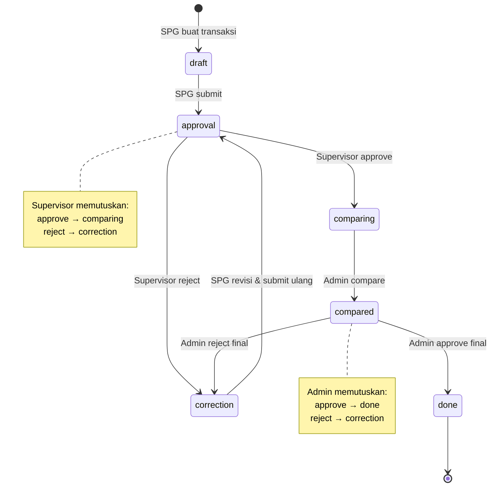
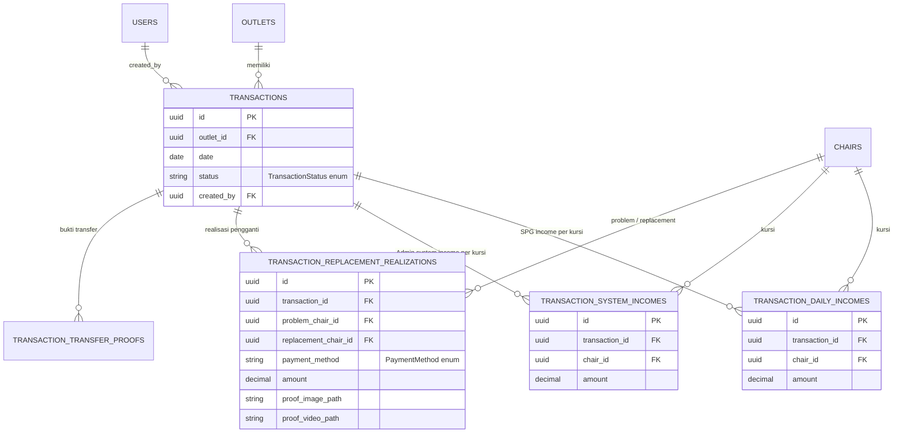
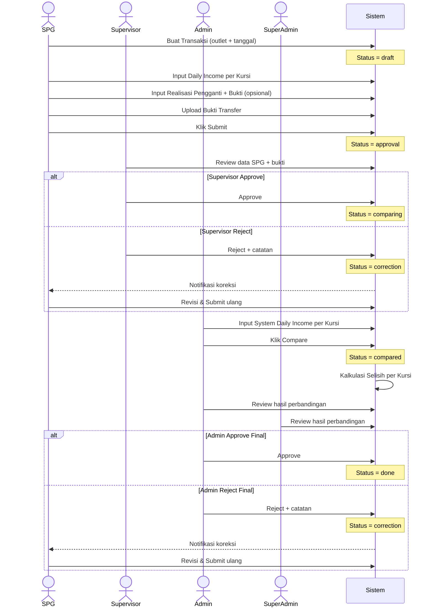
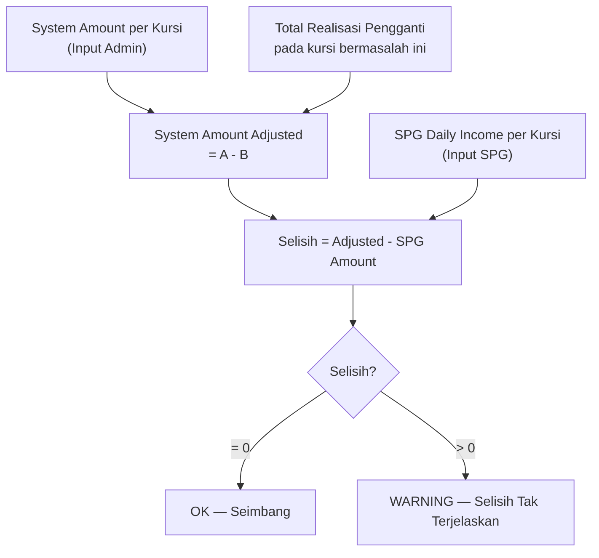

**PRODUCT REQUIREMENTS DOCUMENT & IMPLEMENTATION PLAN**

**Sistem Rekonsiliasi Setoran Tunai**

Mesin Kursi Pijat di Mall

Versi 1.1  |  23 Agustus 2026  |  Fase 1 (Rekonsiliasi Tunai)

---

# **Bagian I: Product Requirements Document (PRD)**

## **1. Executive Summary**
Perusahaan mengoperasikan mesin kursi pijat berbayar (menerima uang tunai dan QRIS) yang tersebar di banyak mall. Setiap transaksi tercatat pada aplikasi milik vendor (server di China). Karena kendala teknis di lapangan, angka yang tercatat aplikasi kerap lebih besar daripada uang tunai yang benar-benar terkumpul, sehingga muncul selisih yang selama ini sulit dilacak dan dijelaskan.

Sistem ini menyediakan mekanisme rekonsiliasi: SPG mencatat setoran riil berikut realisasi pengganti (retry), Supervisor memverifikasi, lalu Admin membandingkan dengan angka dari sistem vendor. Selisih per kursi dapat teridentifikasi secara otomatis, terjelaskan, atau ditandai untuk tindak lanjut.

Fase 1 berfokus pada rekonsiliasi uang tunai. QRIS dan penanganan selisih negatif direncanakan untuk Fase 2.

## **2. Background & Problem Statement**

### **2.1 Sumber angka yang harus dicocokkan**
- **Angka Sistem (versi Admin)** — nominal dari aplikasi vendor, diinput manual oleh Admin per kursi *setelah* Supervisor menyetujui data SPG.
- **Angka Riil (versi SPG)** — uang tunai fisik yang dihitung SPG dari box tiap mesin, disetor via transfer dengan bukti foto.

### **2.2 Akar masalah: pencatatan ganda akibat retry**
Ketika pelanggan memasukkan uang tetapi mesin error/tidak berjalan, SPG mengambil uang tersebut lalu memasukkannya kembali (ke mesin yang sama atau berbeda) agar mesin berjalan. Aplikasi vendor mencatat pemasukan ini dua kali, sedangkan uang fisiknya hanya satu.
Selisih ini disebut **"Realisasi Pengganti"** (retry) yang harus dijelaskan dan dilampiri bukti.

## **3. Goals & Objectives**
1. Mencatat setoran riil (versi SPG) per kursi dan Realisasi Pengganti secara terstruktur per outlet per hari.
2. Memungkinkan Supervisor memverifikasi data SPG sebelum Admin melanjutkan perbandingan.
3. Mencatat angka aplikasi vendor (versi Admin) per kursi setelah data SPG diverifikasi.
4. Menghitung selisih per kursi secara otomatis dengan mempertimbangkan Realisasi Pengganti.
5. Memberi Admin & Super Admin visibilitas penuh atas hasil rekonsiliasi.

## **4. Stakeholders & Hak Akses**

| Role | Hak Akses Utama |
|---|---|
| **Super Admin** | Akses penuh ke semua transaksi (termasuk hasil compared/done) |
| **Admin** | Master data + input System Daily Income + compare + approve/reject final |
| **Supervisor** | List transaksi (outlet yang di-link) + read detail + approve/reject ke Admin |
| **SPG** | Buat transaksi + input daily income + realisasi pengganti + upload bukti + submit |

## **5. Status Lifecycle Transaksi**

```
draft ──► approval ──►comparing──► compared ──► done
           ▲    │         │             │
           │    └────►correction◄───────┘
           └──────────────┘
```

| Status | Siapa yang dapat edit | Keterangan |
|---|---|---|
| `draft` | SPG | Transaksi baru dibuat, semua data bisa diubah |
| `approval` | — (read-only) | SPG sudah submit, menunggu keputusan Supervisor |
| `correction` | SPG | Supervisor **atau** Admin menolak — SPG harus revisi & submit ulang |
| `comparing` | Admin | Supervisor approve → Admin input System Income & compare |
| `compared` | — (read-only) | Admin sudah compare, menunggu persetujuan final Admin |
| `done` | — (read-only) | Admin setujui hasil perbandingan, rekonsiliasi selesai |

## **6. Scope**

### **In Scope**
- Manajemen Master Data (Tempat, Kursi, Role, User, Mapping SPG/Supervisor, Metode Pembayaran).
- SPG membuat Transaksi (parent) per outlet per hari.
- 3 child dari Transaksi: Daily Income per kursi, Realisasi Pengganti, dan Bukti Transfer.
- Alur approval Supervisor lalu Admin.
- Admin input System Income dan kalkulasi selisih per kursi otomatis.
- Visibilitas hasil compared/done untuk Admin & Super Admin.

### **Out of Scope**
- Rekonsiliasi QRIS (Fase 2).
- Penanganan selisih negatif (Fase 2).
- Integrasi API langsung ke aplikasi vendor (Fase 2).

---

# **Bagian II: Gap Analysis**

### **Yang Sudah Terealisasi**
1. **Master Data Dasar:**
   - `roles` dan `users` (autentikasi, 2FA).
   - `outlets` (Master Tempat) dengan latitude, longitude, is_active.
   - `chairs` (Master Kursi) + `chair_prefixes` (Prefix Kode).
   - `linked_outlets_users` (Mapping SPG/Supervisor ke Tempat).
   - `settings`.

### **Yang Belum Terealisasi (Gap)**
1. `transactions` — Parent rekonsiliasi, dibuat oleh SPG.
2. `transaction_daily_incomes` — Pemasukan riil per kursi (isi SPG).
3. `transaction_replacement_realizations` — Realisasi Pengganti (retry) beserta bukti.
4. `transaction_system_incomes` — Pemasukan dari sistem vendor (isi Admin setelah Supervisor approve).
5. `transaction_transfer_proofs` — Bukti transfer SPG.
6. Alur status lifecycle lengkap dan kalkulasi selisih otomatis.
7. PHP Enum: `TransactionStatus` dan `PaymentMethod`.

---

# **Bagian III: Implementation Plan**

## **1. Desain Database (Table Design)**

### **A. PHP Enums**

Dua entitas yang sebelumnya direncanakan sebagai tabel master diganti dengan **PHP Backed Enum** (string-backed). Ini lebih ringan, type-safe, dan tidak memerlukan relasi FK di database.

**`App\Enums\TransactionStatus`**
```php
enum TransactionStatus: string
{
    case Draft      = 'draft';
    case Approval   = 'approval';
    case Correction = 'correction';
    case Comparing  = 'comparing';
    case Compared   = 'compared';
    case Done       = 'done';
}
```

**`App\Enums\PaymentMethod`**
```php
enum PaymentMethod: string
{
    case Cash = 'cash';
    case QRIS = 'qris';
}
```

---

### **B. `transactions` (Parent Rekonsiliasi — Dibuat SPG)**
| Kolom | Tipe | Keterangan |
|---|---|---|
| `id` | uuid PK | |
| `outlet_id` | uuid FK → `outlets` | |
| `date` | date | UNIQUE(outlet_id, date) |
| `status` | string (Enum `TransactionStatus`) | Default `draft` |
| `spg_notes` | text nullable | Catatan SPG saat submit |
| `supervisor_notes` | text nullable | Catatan reject dari Supervisor |
| `admin_notes` | text nullable | Catatan reject dari Admin |
| `created_by` | uuid FK → `users` | SPG yang membuat |
| `supervisor_actioned_by` | uuid nullable FK → `users` | Supervisor yang approve/reject |
| `supervisor_actioned_at` | timestamp nullable | |
| `admin_actioned_by` | uuid nullable FK → `users` | Admin yang compare/approve/reject |
| `admin_actioned_at` | timestamp nullable | |
| `timestamps` | — | |
| `softDeletes` | — | |

---

### **C. `transaction_daily_incomes` (Pemasukan Riil per Kursi — Isi SPG)**
| Kolom | Tipe | Keterangan |
|---|---|---|
| `id` | uuid PK | |
| `transaction_id` | uuid FK → `transactions` | |
| `chair_id` | uuid FK → `chairs` | Hanya kursi milik outlet transaksi |
| `amount` | decimal(15,2) | Nominal riil per kursi |
| `timestamps` | — | |

---

### **D. `transaction_replacement_realizations` (Realisasi Pengganti — Isi SPG)**
| Kolom | Tipe | Keterangan |
|---|---|---|
| `id` | uuid PK | |
| `transaction_id` | uuid FK → `transactions` | |
| `problem_chair_id` | uuid FK → `chairs` | Kursi yang bermasalah/error |
| `replacement_chair_id` | uuid FK → `chairs` | Kursi tempat uang dimasukkan ulang |
| `payment_method` | string (Enum `PaymentMethod`) | `cash` / `qris` |
| `amount` | decimal(15,2) | Nominal (kelipatan 5.000) |
| `proof_image_path` | string nullable | Foto bukti QR berhasil (wajib jika QRIS) |
| `proof_video_path` | string nullable | Video retry (wajib semua metode) |
| `timestamps` | — | |

> **Aturan penamaan file:**
> - Foto QRIS: `{transaction_id}_success_{timestamp}`
> - Video retry: `{transaction_id}_failed_{timestamp}`

---

### **E. `transaction_transfer_proofs` (Bukti Transfer — Upload SPG)**
| Kolom | Tipe | Keterangan |
|---|---|---|
| `id` | uuid PK | |
| `transaction_id` | uuid FK → `transactions` | |
| `proof_image_path` | string | Foto bukti transfer bank |
| `timestamps` | — | |

> **Aturan penamaan file:** `{transaction_id}_transfer-proof`

---

### **F. `transaction_system_incomes` (Pemasukan Sistem Vendor — Isi Admin)**
| Kolom | Tipe | Keterangan |
|---|---|---|
| `id` | uuid PK | |
| `transaction_id` | uuid FK → `transactions` | |
| `chair_id` | uuid FK → `chairs` | |
| `amount` | decimal(15,2) | Nominal dari aplikasi vendor |
| `timestamps` | — | |

---

## **2. Business Flow Detail**

### **Step 1 — SPG: Buat Transaksi (Status: `draft`)**
- SPG membuat transaksi baru dengan memilih **outlet** dan **tanggal**.
- Validasi: kombinasi `outlet_id` + `date` harus **unik** (1 outlet, 1 transaksi per hari).
- Transaksi tersimpan dengan status `draft`.

### **Step 2 — SPG: Isi 3 Child Transaksi (Selama Status `draft` atau `correction`)**
Semua input dapat diedit selama status masih `draft` atau `correction`.

#### **2a. Daily Income per Kursi**
- SPG membuka modal dan memasukkan nominal riil untuk **setiap kursi** yang dimiliki outlet tersebut.
- Kursi yang tersedia di modal = kursi aktif yang di-link ke `outlet_id` transaksi.

#### **2b. Realisasi Pengganti (opsional, bisa lebih dari 1)**
Dibuka via modal. SPG mengisi:
- **Kursi bermasalah** (problem chair)
- **Kursi pengganti** (replacement chair)
- **Nominal** (kelipatan 5.000)
- **Metode Pembayaran:**
  - `QRIS` → wajib upload: foto transaksi QR berhasil + video retry
  - `Cash` → wajib upload: video retry saja

#### **2c. Bukti Transfer**
- SPG mengupload foto bukti transfer setoran pendapatan hari itu.

#### **Submit (draft/correction → approval)**
- Syarat submit: semua kursi sudah terisi nominalnya + minimal 1 bukti transfer terupload.
- Klik **Submit** → status berubah ke `approval`.
- Data tidak dapat diubah SPG selama status `approval`.

---

### **Step 3 — Supervisor: Review & Keputusan (Status: `approval`)**
- Supervisor melihat list transaksi berstatus `approval` dari **outlet yang di-link kepadanya**.
- Supervisor hanya dapat **membaca** detail (daily income, realisasi pengganti, bukti transfer).
- Keputusan Supervisor:
  - **Approve** → status berubah ke `comparing`.
  - **Reject** → status berubah ke `correction`, SPG dapat merevisi.

---

### **Step 4 — Admin: Input System Income & Compare (Status: `comparing`)**
- Admin melihat list transaksi berstatus `comparing`.
- Admin **belum dapat melihat** detail data SPG pada tahap ini (mencegah bias).
- Admin memasukkan **System Daily Income per kursi** (angka dari aplikasi vendor) untuk setiap kursi outlet tersebut.
- Klik **Compare** → status berubah ke `compared`. Admin tidak dapat mengedit lagi.

---

### **Step 5 — Kalkulasi Selisih Otomatis (saat status berubah ke `compared`)**
Sistem melakukan kalkulasi per kursi:

```
System Amount per Kursi
  - Total Realisasi Pengganti (problem_chair_id = kursi ini)
  = System Amount Adjusted

Selisih per Kursi = System Amount Adjusted - SPG Daily Income per Kursi

Jika Selisih > 0  → WARNING: ada selisih tak terjelaskan
Jika Selisih = 0  → OK: seimbang
```

> **Catatan:** Realisasi Pengganti dikurangkan dari System Amount **kursi yang bermasalah** (`problem_chair_id`), bukan dari kursi pengganti.

---

### **Step 6 — Admin: Persetujuan Final (Status: `compared`)**
- Admin dan Super Admin dapat melihat hasil perbandingan lengkap beserta highlight selisih per kursi.
- Keputusan akhir Admin:
  - **Approve** → status berubah ke `done`. Rekonsiliasi selesai.
  - **Reject** → status berubah ke `correction`. SPG merevisi dan alur mulai ulang.

---

## **3. Ringkasan Alur per Role**

| Step | Actor | Aksi | Status Sebelum | Status Sesudah |
|------|-------|------|----------------|----------------|
| 1 | SPG | Buat Transaksi | — | `draft` |
| 2 | SPG | Isi child + Submit | `draft` / `correction` | `approval` |
| 3a | Supervisor | Approve | `approval` | `comparing` |
| 3b | Supervisor | Reject | `approval` | `correction` |
| 4 | Admin | Input System Income + Compare | `comparing` | `compared` |
| 5a | Admin | Approve Final | `compared` | `done` |
| 5b | Admin | Reject Final | `compared` | `correction` |

---

## **4. Frontend Pages (Inertia + React)**

| Halaman | Role | Keterangan |
|---|---|---|
| `Transactions/Index` | SPG | List transaksi milik SPG + tombol buat baru |
| `Transactions/Show` | SPG | Detail transaksi (modal: income, realisasi, bukti) |
| `Supervisor/Transactions/Index` | Supervisor | List transaksi `approval` dari outlet yang di-link |
| `Supervisor/Transactions/Show` | Supervisor | Read-only detail + tombol approve/reject |
| `Admin/Transactions/Index` | Admin | List transaksi `comparing` |
| `Admin/Transactions/Compare` | Admin | Form input System Income + tombol compare |
| `Admin/Transactions/Result` | Admin, Super Admin | Hasil compared dengan highlight selisih per kursi |
| `Admin/Transactions/All` | Admin, Super Admin | Semua transaksi (semua status) |

---

## **5. Aturan Validasi Penting**

1. `outlet_id` + `date` unique pada tabel `transactions`.
2. `chair_id` pada `transaction_daily_incomes` harus milik `outlet_id` transaksi.
3. `amount` pada `transaction_replacement_realizations` harus kelipatan 5.000.
4. Jika `payment_method` = QRIS: `proof_image_path` wajib diisi.
5. `proof_video_path` wajib diisi untuk semua realisasi pengganti (Cash maupun QRIS).
6. Minimal 1 record `transaction_transfer_proofs` sebelum SPG bisa submit.
7. Semua kursi aktif outlet harus terisi di `transaction_daily_incomes` sebelum SPG bisa submit.

---

# **Bagian IV: Visualisasi Diagram**

## **1. Status Lifecycle (State Machine)**



## **2. Entity Relationship Diagram (ERD)**



## **3. Business Flow (Sequence Diagram)**



## **4. Flowchart Kalkulasi Selisih per Kursi**



---

> [!IMPORTANT]
> **Mohon tinjau rencana implementasi ini (v1.1).** Jika desain tabel, alur status, dan logika kalkulasi sudah sesuai, saya akan melanjutkan ke tahap pembuatan migration, model, controller, dan halaman frontend.
